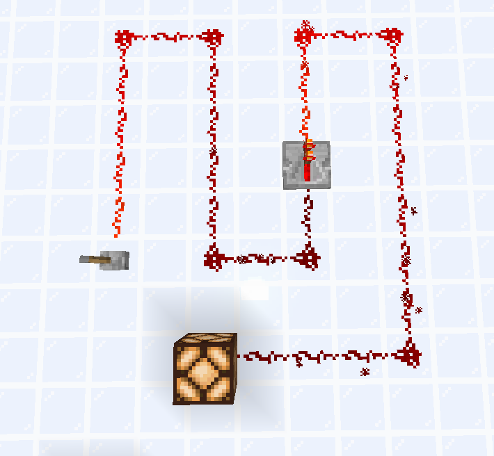

# Delays (PLACEHOLDER)

TODO:

* [ ] Explain Redstone ticks, game ticks, and their relationship with each other.
* [ ] Explain delays from Redstone repeaters
* [ ] Explain delays from Redstone torches

Let's go back to one of the circuits we made on the [Signals](signals.md) page:

If you remember, we placed a repeater as it re-transmits the signal with a signal strength of 15, allowing players to circumvent the limitations of signal strength.

However, notice that when you activate or deactivate the lever, there is now a delay before the signal reaches the other side. This is because the repeater has a **delay**. On this page, we will learn about delays and how they affect Redstone circuits.

