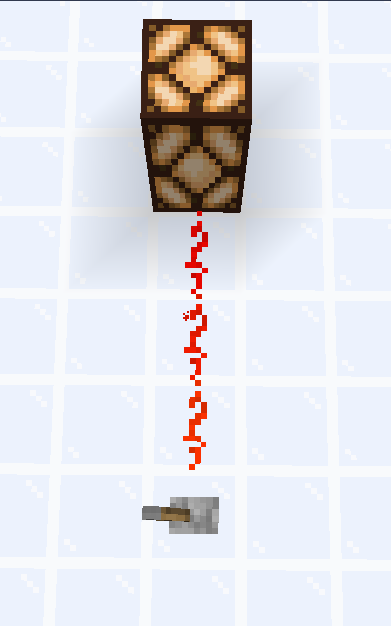
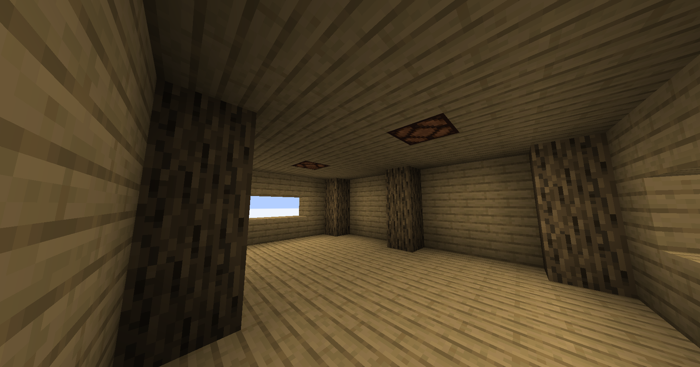

# Signals

[Previous page](setting_up.md) | [Next page](delays.md)

The most fundamental concept of Redstone is the concept of Redstone signals. They can be thought of as "power" flowing through blocks.

## How signals move

Signals can be created through **signal senders** and can be transmitted through **signal transmitters**. The signals can then be received by **signal receivers**. These three types of blocks are therefore **Redstone components** - blocks that interact with Redstone signals. Let's take a small example of a Redstone signal:

What do you think the senders, transmitters, and receivers are in this image? Well, the sender in this case is the lever - it creates a signal when it is turned on (a player right-clicks it). Then, the signal is transmitted through Redstone dust. Finally, a Redstone lamp receives this signal and turns on.

In that image, however, the signal sender isn't **activated**, meaning that it won't send any signal until something activates it. In this case, we can activate the lever by right-clicking it:

As you can see, the lever is now sending a Redstone signal. The signal is then transmitted through the Redstone dust - notice how it lights up. Finally, it reaches the Redstone lamp and **powers** it. In Redstone, when a block is receiving a signal, it is considered **powered**. In this case, the Redstone dust and the Redstone lamp are powered.

### Directional signals

Take a look at this image:

Why do you think the second Redstone lamp isn't being powered?

The answer is that the signal is **directional**. The signal is being transmitted through the Redstone dust, but it can only be received by blocks that the Redstone dust is facing. In this case, the Redstone lamp is facing the opposite direction of the signal, so it is not powered. In the first circuit, the Redstone dust is directly facing the block, so it is powered. However, in the second circuit, the Redstone dust is being **redirected** by another Redstone dust, causing it to face another way, so it is not powered.

## Signal strength

Take a look at this image:

In this image, the lever is sending a signal which is being transmitted through the Redstone dust. However, notice that as the signal travels, the Redstone dust is lighting up less and less. This is because of a concept known as **signal strength**. The signal strength is the amount of Redstone dust that the signal can pass through until it becomes non-existent. Most signal receivers have a signal strength of 15, meaning that the signal can pass through 15 Redstone dust blocks. Look at the last Redstone dust - it has a signal strength of 0, and is therefore not powered.

Signal strength can be a big hindrance when creating contraptions. Therefore, there are many ways to circumvent it. One way is to use a **Redstone repeater**.

The Redstone repeater is another signal transmitter. However, it can be used to strengthen a signal. In the image above, the signal is transmitted through the Redstone dust. Right before the Redstone dust powers the repeater, the signal has a strength of 1. When the repeater is being powered, however, it will transmit the signal with a strength of 15. You can see this visually in the image - the Redstone dust right after the repeater is extremely bright.

## Hard-powering and soft-powering

This is a concept that is very important to understand. It is the difference between a block being **hard-powered** and **soft-powered**.

Take a look at this image:

Why does the circuit at the top power the Redstone lamp but the one at the bottom doesn't? Notice that the signal at the top goes to a repeater, which powers a block. **Repeaters hard-power blocks**. The signal at the bottom simply has Redstone dust powering a block. **Redstone dust soft-powers blocks**.

Redstone dust must be hard-powered to power itself. This is why the circuit at the bottom doesn't work - the Redstone dust is not hard-powered. However, the circuit at the top works because the repeater is hard-powering the block next to the dust.

## Creating a lighting system

Now that we know how signals work, we can create a simple lighting system.

### Specification

We want to create a system that will light up two Redstone lamps in the ceiling of a room when it is nighttime.

### Implementation

First, we need to create a signal sender. We can use a daylight detector for this.

Place one down:

Look at the Redstone signal during daytime and nighttime. Notice that the Redstone is only powered during the day. We want to invert this. To do this, right-click the daylight detector. This will cause it to go to the "Inverted daylight detector" mode (keep in mind that this inversion is unique to the daylight detector). Now, the Redstone signal is only powered during the night.

Now place your daylight detector above the ceiling of your room:

In this image, you can see two Redstone dust coming out of the daylight detector. These will soft-power the block below them, which will power the Redstone lamp (Redstone lamps take soft power).

Now let's see it in action:

Congratulations! You have created your first Redstone contraption! This concludes the first section of the tutorial.

## Summary

In this section, we learned about the concept of Redstone signals. We learned how they move, how they are created, and how they are received. We also learned about signal strength and hard-powering vs soft-powering. Finally, we created a simple lighting system that lights up during the night.

[Previous page](setting_up.md) | [Next page](delays.md)

## Challenges

### Challenge 1

We briefly mentioned that Redstone dust is directional. Find out why this makes target blocks extremely useful.

### Challenge 2

Find out how this circuit works:

In addition, build this in both Java edition and Bedrock edition and see if it works the same way.

If you don't know how it works, don't worry, it will be covered in the future.
