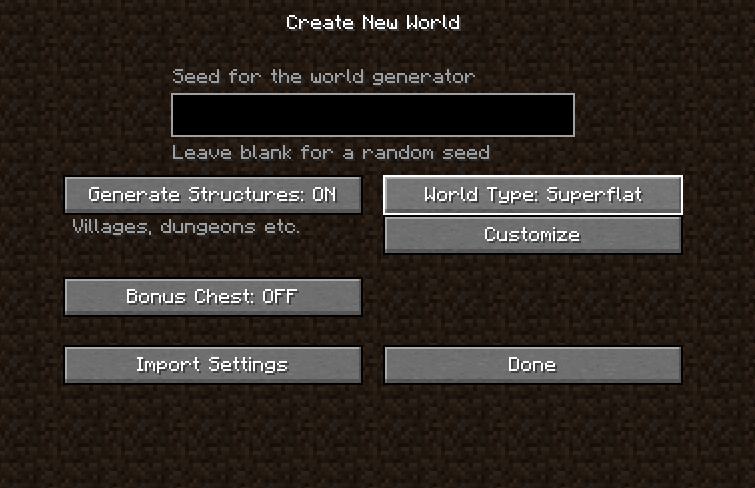
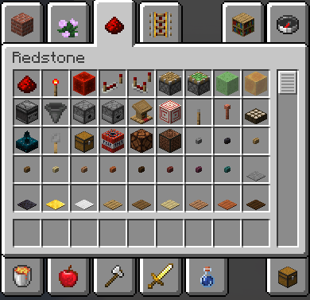

# Setting Up

Our journey begins here: we are going to start with the basics of Redstone. But before we create cool stuff, we have to first learn some of the basics.

## Creating a superflat world

When you launch Minecraft, click on `Singleplayer`. If you're in a world browser, click `Create New World`. Now, configure the options you want, but the important thing is that you click on `More World Options...`, and change `World Type` to `Superflat`.

After you have finished choosing what you want in your world, you can click on `Create New World` on the bottom left, and you're done!

## Setting up your inventory

Now, open your creative inventory. If you have played Creative mode before, this should be familiar to you. The creative inventory has tabs of items to browse through. Go to the tab with the Redstone dust icon, labeled "Redstone":

(If you're extra savvy, you could use a feature called saved hotbars, but we won't get into those.)

This will be your "base of operations", where you will get most of your Redstone **components** - blocks that interact with Redstone **signals**. Don't worry about the terminology right now, we are going to explain them later.

In addition to this tab, you would also want to have blocks to place the components on - most of them can't float in the air. For now, you can choose any full (non-transparent) block. We'll use white concrete. (It's also good to choose blocks that have colored variants, so it's easier to manage different parts of your contraptions in the future - blocks like wool, terracotta, and concrete are nice.)

You're done setting up your world! In this world, you will do your experimentation and learning!
